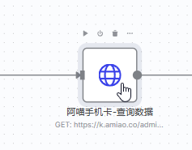

# N8N工作流教程


## 安装

```bash
docker volume create n8n_data
docker run -d --name n8n -p 5678:5678 -e N8N_SECURE_COOKIE=false   -v n8n_data:/home/node/.n8n docker.n8n.io/n8nio/n8n
```


## 访问

使用浏览器 打开`http://your_ip:5678`,设置账号密码并进入首页


## 工作流使用教程

1. 新建工作流


2. 导入工作流(选择项目下`n8n_flow/My workflow 2.json`文件进行导入)
     

  3. 注册流量卡平台账号 [飞书教程](https://ucnkpch5d597.feishu.cn/wiki/FGnxw9oOoiXpZDklW2tc5luvnGd?from=from_copylink)

  4. 登录[电脑端后台](https://ka.dandanhou.net/agent/tixian),按下`F12`弹出开发者模式

  5. 获取请求接口数据(按图中的操作)

     

  6. 双击该节点

     

  7. 按照图中的流程进行操作, 点击`Execute step` 返回数据那么就是正常的

     

  8. 修改`LLM`,由于国内很多模型使用不方便,此处使用`deepseek`,后续可根据需要自行替换

  9. 双击`DeepSeek Chat Model5` 节点

  10. 创建一个新的凭证(`deepseek api官网地址`  [DeepSeek 开放平台](https://platform.deepseek.com/usage)),充值即可


  11. 双击`保存数据`节点,修改实际的`URL`和`API-TOKEN-KEY`

  12. 配置邮件通知(按需)
      
        1. 双击`Send email`节点
        2. 创建一个新凭证(`QQ邮箱示例`,配置教程 [【问题】如何设置QQ邮箱支持的smtp（以支持程序发送邮件），及n8n的smtp凭证设置示例-CSDN博客](https://blog.csdn.net/2501_90561511/article/details/149806716))
        3. 填写 `From Email` ,`To Email` 属性
  13. 开始测试 ,点击画布中央`Execute workflow`,如果没有问题,那么点击`Save`和旁边的`Inactive`(如果这个没有点击,那么定时任务不会触发)


## 后记

这个教程基本上可以让大家知道如何使用`n8n`,对于更多需求,可以查看联系我一起学习。

其他的流量卡平台可以按照此方法进行举一反三