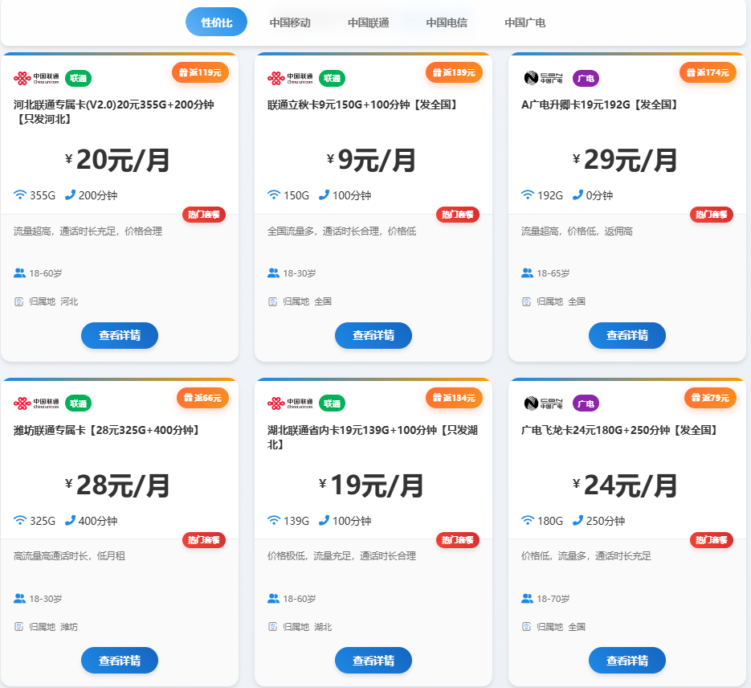

# N8N 工作流 实现自动抓取流量卡数据

基于`N8N`工作流+`LLM大模型`定时抓取流量卡平台手机卡套餐信息进行聚合展示(包含**返佣**)。

采用`docker`轻量级部署

[懒人地址(点击即可使用)](https://withmes.xin/card)


部署效果图如下：



## ✨ 功能特性

### 🎯 核心功能
- **手机卡数据管理**
- **REST API 服务**
- **数据聚合**

### 🛠️ 技术特性
- **高性能**: 基于 FastAPI 异步框架，支持高并发
- **数据缓存**: 内置缓存机制，提升响应速度
- **事件记录**: 完整的用户行为事件记录系统
- **配置管理**: 灵活的环境配置管理系统
- **Docker 支持**: 完整的 Docker 容器化部署方案

## 🚀 快速开始

### 部署要求

- `Linux/Unix` 操作系统
- `Docker `
- 开放`80`端口

### 部署教程

1. **克隆项目**
```bash
git clone https://github.com/your-username/n8n_qiongbi_ka.git
```

2. 将项目上传到`Linux/Unix`服务器,并进入`n8n_qiongbi_ka` 目录
3. 修改配置文件(`.env.docker`) 配置项(**强烈建议修改**)
```bash
DB_USERNAME=root #mysql 用户名
DB_PASSWORD=123456 #mysql 密码
API_TOKEN_KEY=2240DA80B95849C1BE1FFD31002C8A #API请求密钥

```

4. 修改`docker-compose.yml`配置项(**强烈建议修改**)

```bash
      MYSQL_ROOT_PASSWORD: 123456 #如果第3步修改了此项,那么这里也需要修改
```


5. 赋予一键安装脚本执行权限
```bash
chmod +x deploy.sh

```

6. 编译/运行项目
```bash
./deploy.sh
```

7. 检查结果
打开浏览器,访问 `http://your_ip:80/card`

7. `N8N`工作流部署
请看 [教程](N8N_AUTO_FLOW.md)

## 🤝 贡献指南

我们欢迎所有形式的贡献！请查看 [CONTRIBUTING.md](CONTRIBUTING.md) 了解详细信息。

### 贡献方式

- 🐛 报告 Bug
- 💡 提出新功能建议
- 📝 改进文档
- 🔧 提交代码修复
- ⭐ 给项目点星支持

### 开发流程

1. `Fork `项目
2. 创建功能分支 (`git checkout -b feature/AmazingFeature`)
3. 提交更改 (`git commit -m 'Add some AmazingFeature'`)
4. 推送到分支 (`git push origin feature/AmazingFeature`)
5. 创建 `Pull Request`

## 📄 许可证

本项目采用 MIT 许可证 - 查看 [LICENSE](LICENSE) 文件了解详情。

## 🙏 致谢

感谢所有为这个项目做出贡献的开发者！


---

⭐ 如果这个项目对你有帮助，请给我们一个星标！
